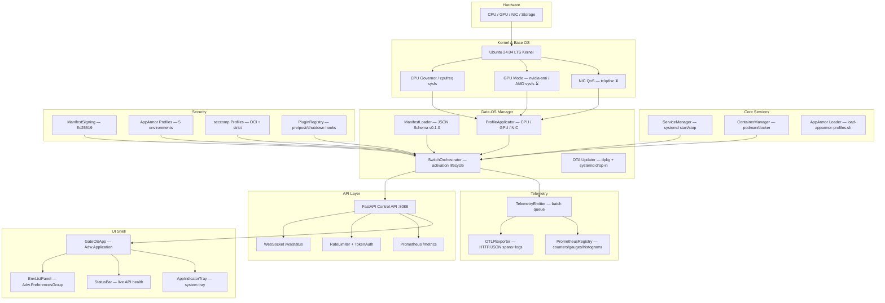
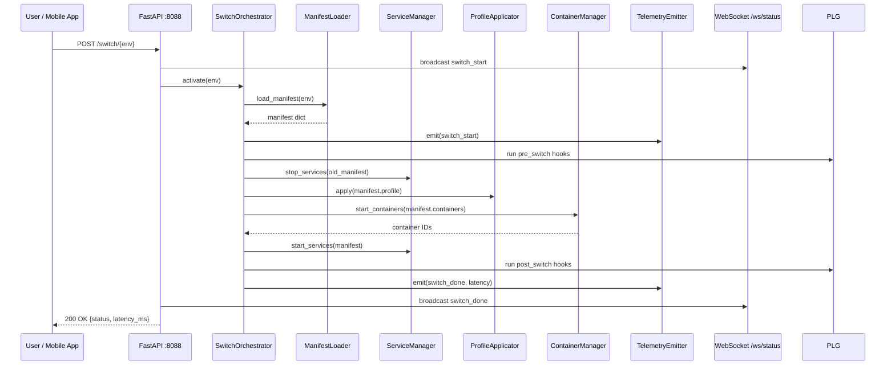

# Architecture Overview

> Ultra Cube Tech — Foundation of the multi-environment OS.  
> Current version: **v1.1.0** | 228 tests passing | 87% coverage

---

## System Layers

---

## Logical Layers

| Layer | Responsibility | Implementation |
|-------|----------------|----------------|
| Kernel/Base | Performance, hardware drivers | Ubuntu 24.04 LTS + cpufreq sysfs |
| Core Services | systemd orchestration, container lifecycle | `ServiceManager`, `ContainerManager` |
| Env Manager | Switch lifecycle, manifest validation, rollback | `SwitchOrchestrator`, `ManifestLoader` |
| Profile Application | CPU governor, GPU mode, NIC priority | `ProfileApplicator` |
| Security | AppArmor/seccomp enforcement, manifest signing | `signing.py`, `profiles/` |
| Control API | REST + WebSocket; auth, rate limiting | FastAPI + `api/server.py`, `api/websocket.py` |
| Telemetry | Structured events, Prometheus metrics, OTLP | `telemetry/emitter.py`, `telemetry/otlp.py` |
| UI Shell | GTK4/Libadwaita desktop panel + system tray | `ui/app.py`, `ui/tray.py` |
| Plugin System | Pre/post/shutdown extension hooks | `plugins/registry.py` |
| OTA Updater | Version check, dpkg apply, systemd drop-in | `updater.py` |

---

## Technical Stack

| Component | Technology | Status |
|-----------|-----------|--------|
| Language | Python 3.12 | ✅ Active |
| Base OS | Ubuntu 24.04 LTS | ✅ Confirmed |
| UI Toolkit | GTK4 + Libadwaita (PyGObject ≥ 3.44) | ✅ Implemented |
| Container Runtime | Podman (+ Docker fallback) | ✅ Real orchestration |
| Init System | systemd (units + drop-ins) | ✅ Active |
| Control API | FastAPI + uvicorn | ✅ Implemented |
| Telemetry | OTLP/HTTP JSON (custom, no SDK) + Prometheus | ✅ Implemented |
| Security | AppArmor (5 profiles) + seccomp (2 configs) + Ed25519 signing | ✅ Implemented |
| Packaging | `.deb` build + preseed generator | ✅ Implemented |
| ISO Build | `scripts/build-iso.sh` (xorriso + squashfs) | ✅ Implemented |
| Docs | MkDocs Material + GitHub Pages | ⏳ Deploy pending |
| Mobile | WebSocket API ready; Flutter app | ⏳ Planned Phase 14 |

---

## Environment Switching Flow

---

## Module Dependency Map

See [docs/diagrams/](../diagrams/) for Mermaid diagram files.

Key dependencies:
- `switch/orchestrator.py` → `manifest/loader.py`, `containers/manager.py`, `services/__init__.py`, `profile/__init__.py`, `plugins/registry.py`, `telemetry/emitter.py`
- `api/server.py` → `switch/orchestrator.py`, `telemetry/prometheus.py`, `api/auth.py`, `api/rate_limit.py`
- `ui/app.py` → `ui/api_client.py`, `ui/env_list.py`, `ui/switch_button.py`, `ui/status_bar.py`, `ui/tray.py`
- `updater.py` → `telemetry/emitter.py`
- `telemetry/otlp.py` → (no internal deps, stdlib only)

---

## Configuration Strategy

- Declarative JSON manifests per environment (`data/environments/*.json`)
- Versioned JSON Schema v0.1.0 with migration hooks (`manifest/loader.py`)
- Schema: `docs/architecture/schemas/environment-manifest.schema.yaml`
- All runtime tunables via env vars (`GATEOS_*` prefix)

---

## Security Architecture

| Threat Surface | Current Control | Planned Enhancement |
|----------------|-----------------|---------------------|
| API Token | Static random token (env var) | Rotating token + OIDC stub (Phase 13) |
| Plugin Execution | Import + run (trusted) | Signature + process sandbox (Phase 13) |
| Manifests | JSON Schema + Ed25519 verification | allowlistRef policy engine (Phase 12) |
| Containers | AppArmor + seccomp per env | Digest pinning + network namespace (Phase 12/13) |
| Telemetry Transport | Plain HTTP OTLP | TLS + PII redaction (Phase 13) |
| Supply Chain | Syft SBOM + Grype scan (CI) | SLSA provenance attestation (Phase 13) |

---

## Open Items (Tracked)

| Item | Phase | Status |
|------|-------|--------|
| GPU real implementation (nvidia-smi / AMD sysfs) | 12 | ⏳ Planned |
| NIC priority via tc/qdisc | 12 | ⏳ Planned |
| Network namespace per container | 12 | ⏳ Planned |
| Architecture diagram files in docs/diagrams/ | 11 | ⏳ Next sprint |
| DDE shell adapter interface | 12 | ⏳ Planned |

---

**Date:** March 2026 | **By:** Fadhel.SH  
**Company:** [Ultra-Cube Tech](https://ucubetech.com) | [GitHub](https://github.com/Ultra-Cube/) | [LinkedIn](https://www.linkedin.com/company/ultra-cube)
