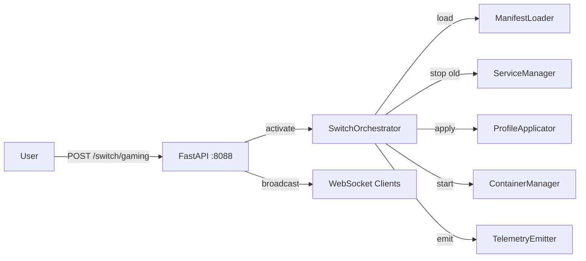

# Diagrams Index

> All architecture diagrams use [Mermaid](https://mermaid.js.org/) — rendered natively in GitHub and MkDocs Material.

## Available Diagrams

| File | Diagram Type | Description |
|------|-------------|-------------|
| [system-architecture.md](system-architecture.md) | C4 / Component | Layer-by-layer system overview |
| [env-switch-sequence.md](env-switch-sequence.md) | Sequence | Full environment switch request flow |
| [module-boundaries.md](module-boundaries.md) | Graph | gateos_manager package dependencies |
| [api-flow.md](api-flow.md) | Sequence | REST + WebSocket API request/response |

## Environment Switch (Quick Reference)

---
**Last updated:** March 2026 | **By:** Fadhel.SH | **Company:** Ultra-Cube Tech
