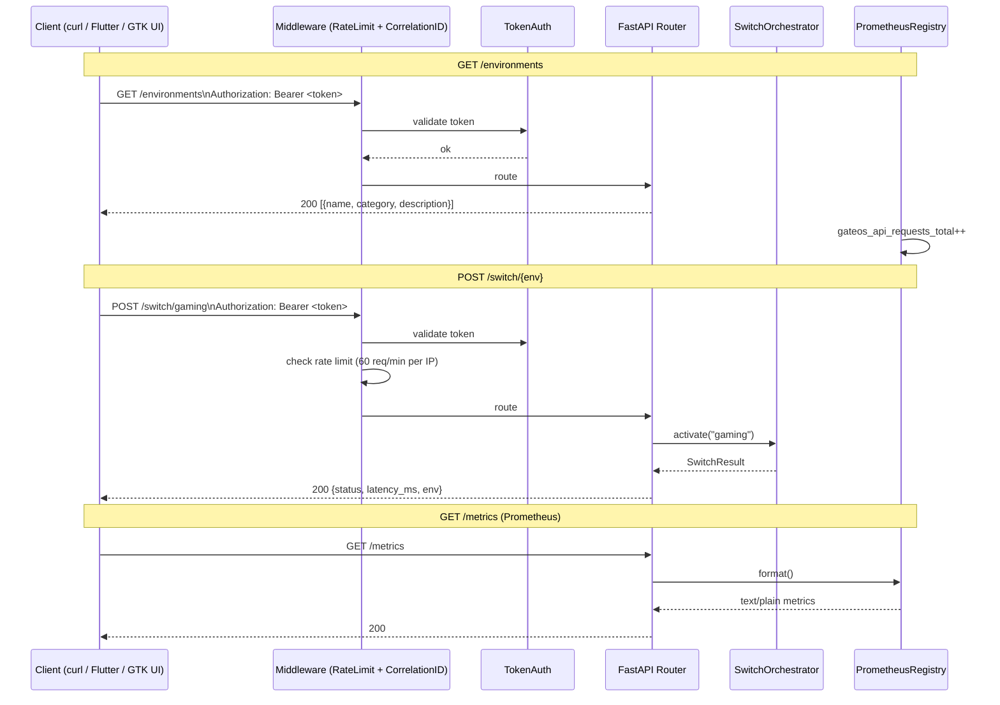
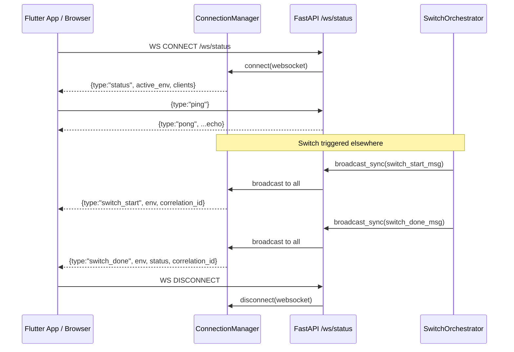
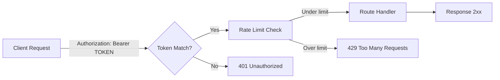

# API Flow Diagram

> REST and WebSocket request/response flows for the Gate-OS Control API.

## REST API Endpoints

## WebSocket Flow

## Authentication Model

## Error Response Codes

| Code | Scenario |
|------|---------|
| 200 | Success |
| 400 | Invalid environment name or malformed request |
| 401 | Missing or invalid bearer token |
| 404 | Environment not found in manifests |
| 409 | Switch already in progress |
| 429 | Rate limit exceeded |
| 500 | Internal error (logged with correlation_id) |

---
**Last updated:** March 2026 | **By:** Fadhel.SH
