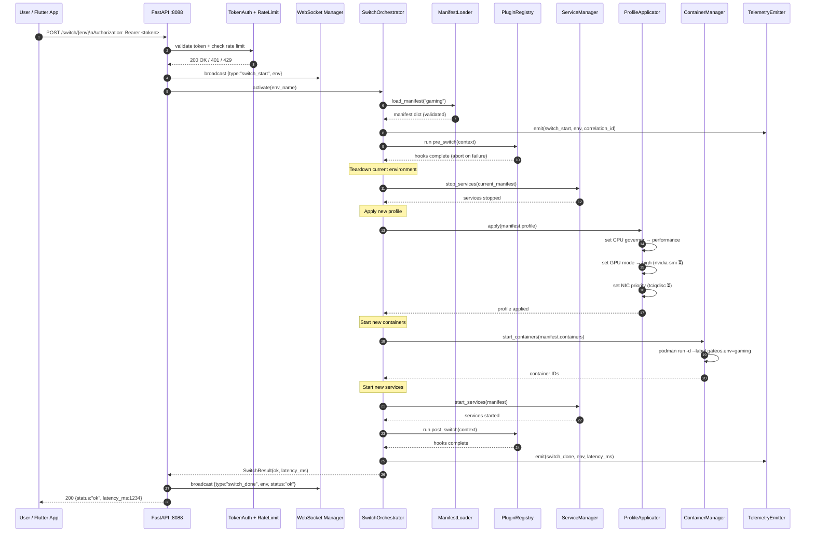
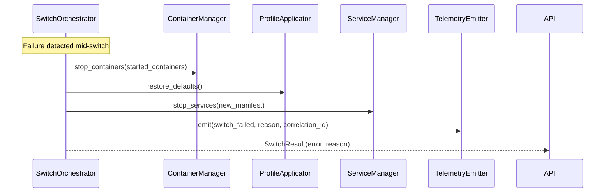

# Environment Switch — Sequence Diagram

> Full flow from user action to environment live.

```mermaid
sequenceDiagram
    autonumber
    participant U as User / Flutter App
    participant API as FastAPI :8088
    participant AUTH as TokenAuth + RateLimit
    participant WS as WebSocket Manager
    participant SO as SwitchOrchestrator
    participant ML as ManifestLoader
    participant PLG as PluginRegistry
    participant SM as ServiceManager
    participant PA as ProfileApplicator
    participant CM as ContainerManager
    participant TE as TelemetryEmitter

    U->>API: POST /switch/{env}\nAuthorization: Bearer <token>
    API->>AUTH: validate token + check rate limit
    AUTH-->>API: 200 OK / 401 / 429

    API->>WS: broadcast {type:"switch_start", env}
    API->>SO: activate(env_name)

    SO->>ML: load_manifest("gaming")
    ML-->>SO: manifest dict (validated)

    SO->>TE: emit(switch_start, env, correlation_id)

    SO->>PLG: run pre_switch(context)
    PLG-->>SO: hooks complete (abort on failure)

    Note over SO: Teardown current environment
    SO->>SM: stop_services(current_manifest)
    SM-->>SO: services stopped

    Note over SO: Apply new profile
    SO->>PA: apply(manifest.profile)
    PA->>PA: set CPU governor → performance
    PA->>PA: set GPU mode → high (nvidia-smi ⏳)
    PA->>PA: set NIC priority (tc/qdisc ⏳)
    PA-->>SO: profile applied

    Note over SO: Start new containers
    SO->>CM: start_containers(manifest.containers)
    CM->>CM: podman run -d --label gateos.env=gaming
    CM-->>SO: container IDs

    Note over SO: Start new services
    SO->>SM: start_services(manifest)
    SM-->>SO: services started

    SO->>PLG: run post_switch(context)
    PLG-->>SO: hooks complete

    SO->>TE: emit(switch_done, env, latency_ms)
    SO-->>API: SwitchResult(ok, latency_ms)

    API->>WS: broadcast {type:"switch_done", env, status:"ok"}
    API-->>U: 200 {status:"ok", latency_ms:1234}
```

## Rollback Flow (on failure)

```mermaid
sequenceDiagram
    participant SO as SwitchOrchestrator
    participant CM as ContainerManager
    participant PA as ProfileApplicator
    participant SM as ServiceManager
    participant TE as TelemetryEmitter

    Note over SO: Failure detected mid-switch
    SO->>CM: stop_containers(started_containers)
    SO->>PA: restore_defaults()
    SO->>SM: stop_services(new_manifest)
    SO->>TE: emit(switch_failed, reason, correlation_id)
    SO-->>API: SwitchResult(error, reason)
```

---
**Last updated:** March 2026 | **By:** Fadhel.SH
