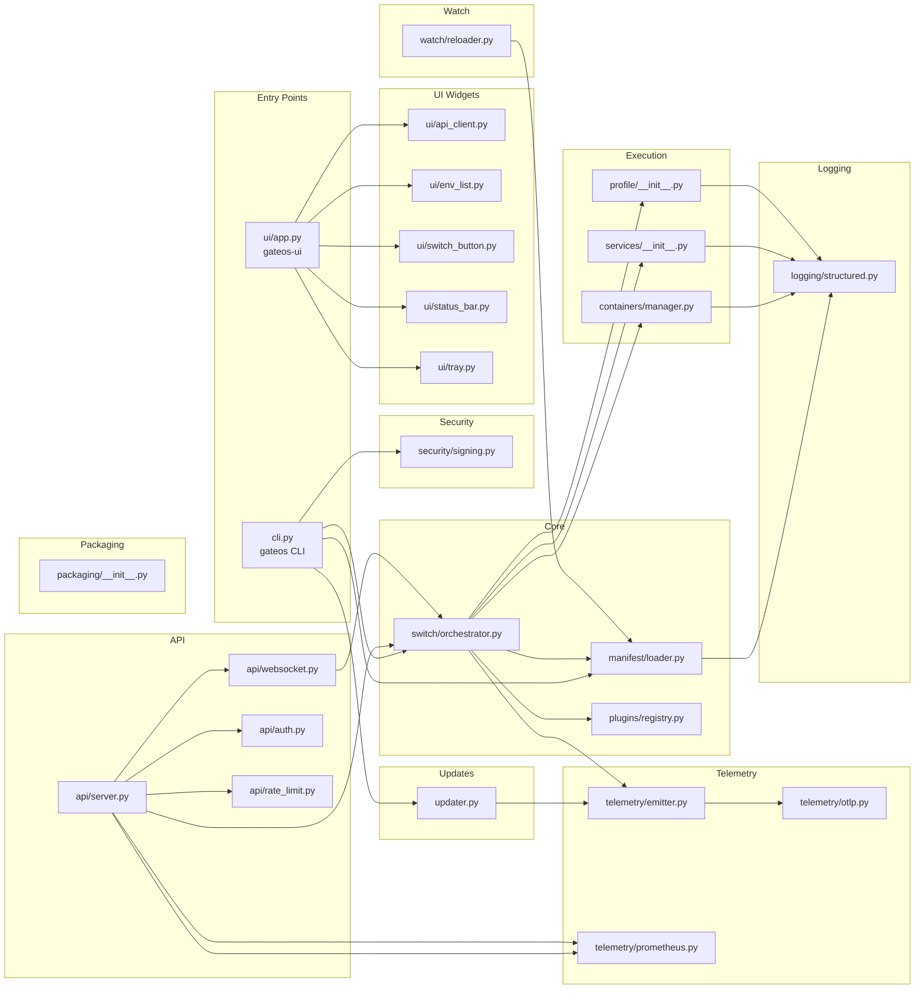

# Module Dependency Map

> Internal `gateos_manager/` package dependencies.



## Package Structure

```
gateos_manager/
├── __init__.py          (package root)
├── cli.py               (Click CLI: validate/api/switch/sign/verify/gen-keypair)
├── updater.py           (OTA: check/apply/schedule_apply)
├── api/
│   ├── server.py        (FastAPI app, routers, middleware)
│   ├── websocket.py     (ConnectionManager, /ws/status)
│   ├── auth.py          (token validation)
│   └── rate_limit.py    (sliding window limiter)
├── manifest/
│   └── loader.py        (load_manifest, validate_manifest, schema migration)
├── switch/
│   └── orchestrator.py  (SwitchOrchestrator, SwitchContext, rollback)
├── containers/
│   └── manager.py       (ContainerManager, podman/docker, timeout, labels)
├── services/
│   └── __init__.py      (ServiceManager, start/stop/status)
├── profile/
│   └── __init__.py      (ProfileApplicator, CPU/GPU/NIC)
├── security/
│   └── signing.py       (sign_manifest, verify_manifest, gen_keypair)
├── plugins/
│   └── registry.py      (PluginRegistry, entry-point discovery)
├── telemetry/
│   ├── emitter.py       (TelemetryEmitter, batch queue)
│   ├── otlp.py          (OTLPExporter, HTTP/JSON, singleton)
│   └── prometheus.py    (MetricsRegistry, Counter/Gauge/Histogram)
├── logging/
│   └── structured.py    (structlog-based structured logger)
├── ui/
│   ├── __init__.py      (GTK_AVAILABLE guard, GtkNotAvailableError)
│   ├── api_client.py    (GateOSAPI, stdlib HTTP)
│   ├── app.py           (GateOSApp, GateOSWindow)
│   ├── env_list.py      (EnvListPanel, EnvRow)
│   ├── switch_button.py (SwitchButton)
│   ├── status_bar.py    (StatusBar)
│   └── tray.py          (AppIndicatorTray)
├── watch/
│   └── reloader.py      (start_watch, ManifestEventHandler)
└── packaging/
    └── __init__.py      (build_deb, generate_preseed, generate_postinstall_script)
```

---
**Last updated:** March 2026 | **By:** Fadhel.SH
